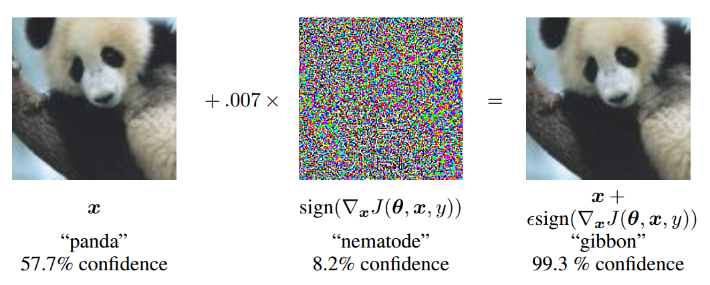

# captcha-adversarial-attack

基于深度学习的验证码破解、对抗与反对抗研究

## 文档说明
1. main.ipynb Jupyter版本（效果佳）
2. main.html 网页版本（效果佳）
3. main.pdf PDF版本

## 部分展示

---

## 对抗样本

### 什么是对抗样本
Christian Szegedy等人在ICLR2014发表的论文中，他们提出了对抗样本（Adversarial examples）的概念，即在数据集中通过故意添加细微的干扰所形成的输入样本，受干扰之后的输入导致模型以高置信度给出一个错误的输出。在他们的论文中，他们发现包括卷积神经网络（Convolutional Neural Network, CNN）在内的深度学习模型对于对抗样本都具有极高的脆弱性。他们的研究提到，很多情况下，在训练集的不同子集上训练得到的具有不同结构的模型都会对相同的对抗样本实现误分，这意味着对抗样本成为了训练算法的一个盲点。


### 如何产生对抗样本
生成式对抗网络的发明人Ian Goodfellow在《Explaining and Harnessing Adversarial Examples》中提出了一种更快速方便的方法来产生对抗样本：
```
X' = X + ε⋅sign(∇xJ(Θ, x, y))
```
这种方法的思想非常简单，就是让输入图像朝着让类别置信度降低的方向上移动一个在各个维度上都是ε这么大小的一步。因为输入通常是高维的（比如224x224），再加上现在的主流神经网络结构都是ReLU系的激活函数，线性程度其实很高，所以即使是很小的ε，每个维度的效果加一块，通常也足以对结果产生很大的影响。在计算上，这种方法优势巨大，因为只需要一次前向和一次后向梯度计算就可以了。Ian Goodfellow称之为Fast Gradient Sign method。


### 深度学习的脆弱性
一个推断性的解释是深度神经网络的高度非线性特征，以及纯粹的监督学习模型中不充分的模型平均和不充分的正则化所导致的过拟合。Ian Goodfellow 在ICLR2015年的论文中，通过在一个线性模型加入对抗干扰，发现只要线性模型的输入拥有足够的维度（事实上大部分情况下，模型输入的维度都比较大，因为维度过小的输入会导致模型的准确率过低），线性模型也对对抗样本表现出明显的脆弱性，这也驳斥了关于对抗样本是因为模型的高度非线性的解释。相反深度学习的对抗样本是由于模型的线性特征。

### 对抗样本的危害性
如果我们有两张图片，人眼看上去一模一样，都是一间房子，但是cnn把一张分类为房子，一张分类为鸵鸟，这种分类器还有什么用啊。如果我们的模型随随便便就被欺骗，还能被投入使用吗，那那些研究不成了纸上谈兵了吗。另一方面，有人觉得即使是Ian的方法，都需要知道梯度才能找到对抗样本，可是攻击者怎么知道模型是什么样子呢？可惜对抗样本还有一个重要性质，叫做Transferability，转移性。很多的时候，两个模型即使有不同的结构并在不同的训练集上被训练，一种模型的对抗样本在另一个模型中也同样会被误分，甚至它们还会将对抗样本误分为相同的类。这是因为对抗样本与模型的权值向量高度吻合，同时为了训练执行相同的任务，不同的模型学习了相似的函数。这种泛化特征意味着如果有人希望对模型进行恶意攻击，攻击者根本不必访问需要攻击的目标模型，就可以通过训练自己的模型来产生对抗样本，然后将这些对抗样本部署到他们需要攻击的模型中。这个可以称作灾难了，最后的堡垒也被攻破了，我们再怎么隐藏模型的细节，也可能会被攻击。

### 换个思路走的更远
正如攻击者可以利用对抗样本来攻击深度学习模型，同理我们也可以利用对抗样本来巩固自己的深度学习模型，例如前面已经被破解的验证码......

---

> 参考论文
1. Christian Szegedy, Wojciech Zaremba, Ilya Sutskever, Joan Bruna, Dumitru Erhan, Ian Goodfellow, Rob Fergus - [Intriguing properties of neural networks](https://arxiv.org/abs/1312.6199)
2. Ian J. Goodfellow, Jonathon Shlens, Christian Szegedy - [Explaining and Harnessing Adversarial Examples](https://arxiv.org/abs/1412.6572)
3. Karen Simonyan, Andrew Zisserman - [Very Deep Convolutional Networks for Large-Scale Image Recognition](https://arxiv.org/abs/1409.1556)

> 参考链接
1. http://www.infoq.com/cn/news/2015/07/adversarial-examples
2. http://blog.csdn.net/cdpac/article/details/53170940
3. https://zhuanlan.zhihu.com/p/26122612
